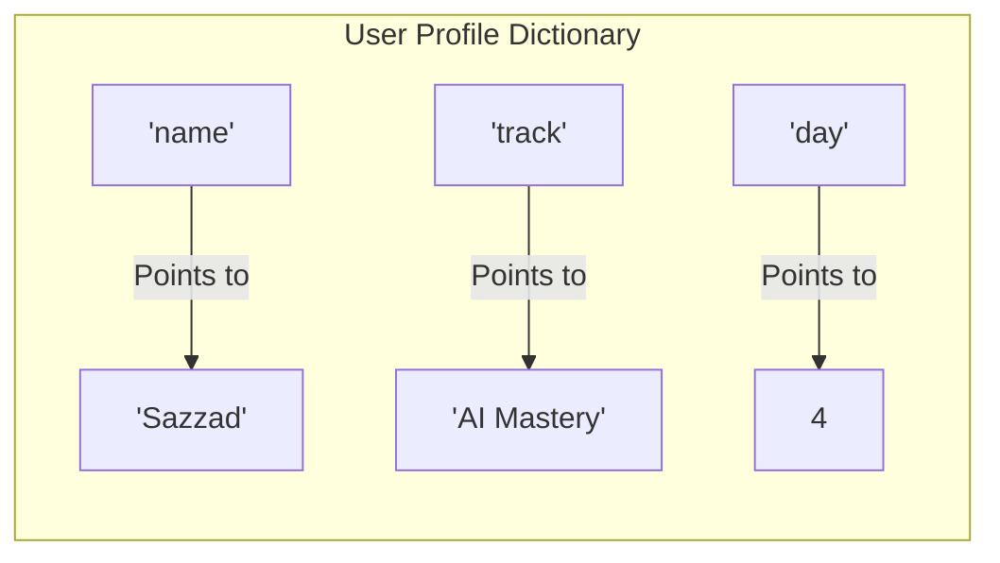
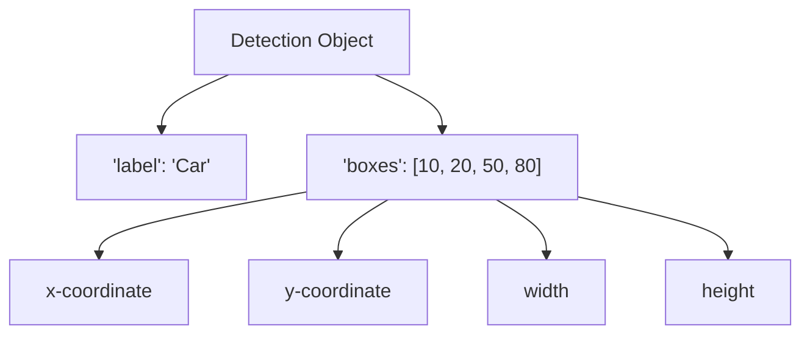

# Visual Guide: Dictionaries (Key-Value Pairs) 🗺️

In mathematics and AI, we call this a **Mapping**. It’s like a function where you provide an input (Key) and get a specific output (Value).

## 1. The Mathematical view
If $f(x) = y$, then in a dictionary:
- $x$ is the **Key**
- $y$ is the **Value**

For example:
$f(\text{"model"})$ = "Llama-3"
$f(\text{"accuracy"})$ = 0.95

## 2. The Structural Layout (Mermaid Diagram)

## 3. List vs. Dictionary (The Big Difference)

| Feature | List (Container) | Dictionary (Labeler) |
| :--- | :--- | :--- |
| **How to find data** | By Position (Index: 0, 1, 2) | By Name (Label: "name", "id") |
| **Analogy** | A row of lockers with numbers | A shelf of labeled folders |
| **AI Use Case** | Storing raw pixel values | Storing model settings/results |

## 4. Nested Structure (The AI Reality)
In real AI projects, dictionaries often hold lists!

