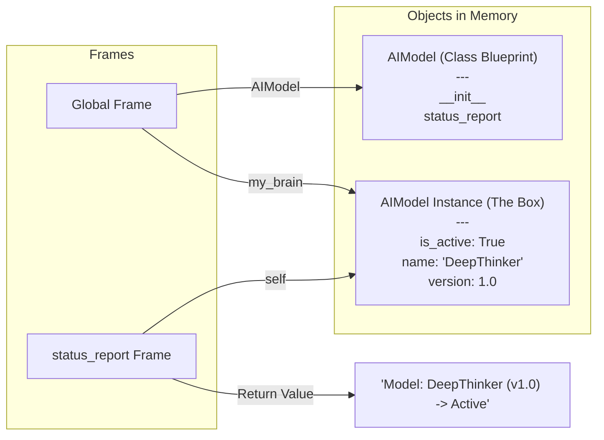
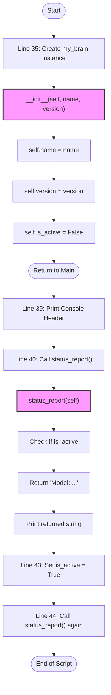

# Visual Trace: Day 7 - Class Roots 🤖

This diagram recreates the internal state of Python's memory as you saw in the Python Tutor screenshot.

## 1. Memory Layout (Frames vs. Objects)

## 2. The Relationship Matrix

| Frame | Variable | Pointer Destination | Why? |
| :--- | :--- | :--- | :--- |
| **Global** | `my_brain` | `AIModel instance` | This is your main handle for the object. |
| **status_report** | `self` | `AIModel instance` | `self` is just the function's way of reaching the box. |
| **Global** | `AIModel` | `AIModel class` | Points to the blueprint so you can make more. |

## 4. Logic Flowchart (Code Visualizer Style) 📊
This shows how the code "moves" from line to line, jumping into functions and back out.

## 5. Call Hierarchy
- `Main Script`
    - `AIModel.__init__`
    - `AIModel.status_report`
    - `AIModel.status_report`
