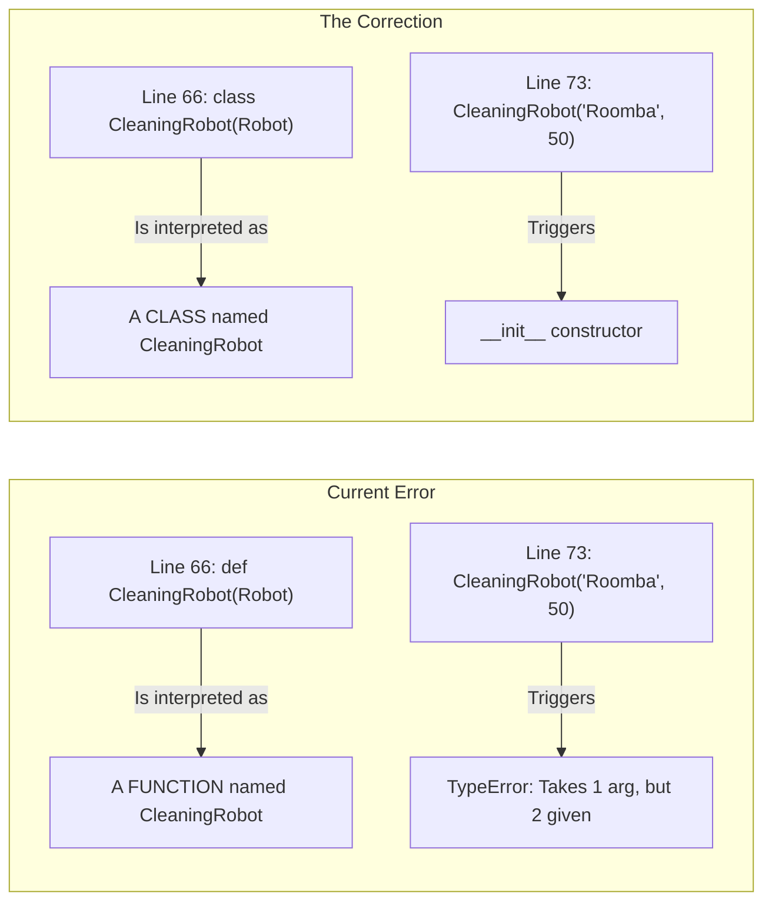
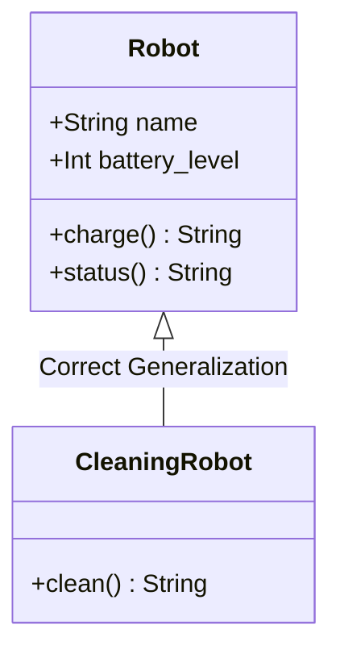

# Debug Trace: Day 8 - Fixing Inheritance 🐞

This trace explains why the code crashed and how to "think" like Python when debugging class structures.

## 1. The Error Visualization (What Python Saw) 🛑

## 2. Symptom & Cure Table

| Symptom | The Cause | The Cure |
| :--- | :--- | :--- |
| **`TypeError: ... but 2 given`** | You used `def` instead of `class`. Functions view `Robot` as a variable, not a parent. | Change `def` to `class`. |
| **`AttributeError: 'NoneType' ...`** | Because your function didn't `return`, `roomba` became `None`. | Making it a `class` automatically returns the new object. |
| **`AttributeError: 'Robot' has no 'version'`** | Line 59 had a loose variable `self.version` with no value. | Either assign a value or remove the line. |

## 3. High-Fidelity UML Correction 📐

