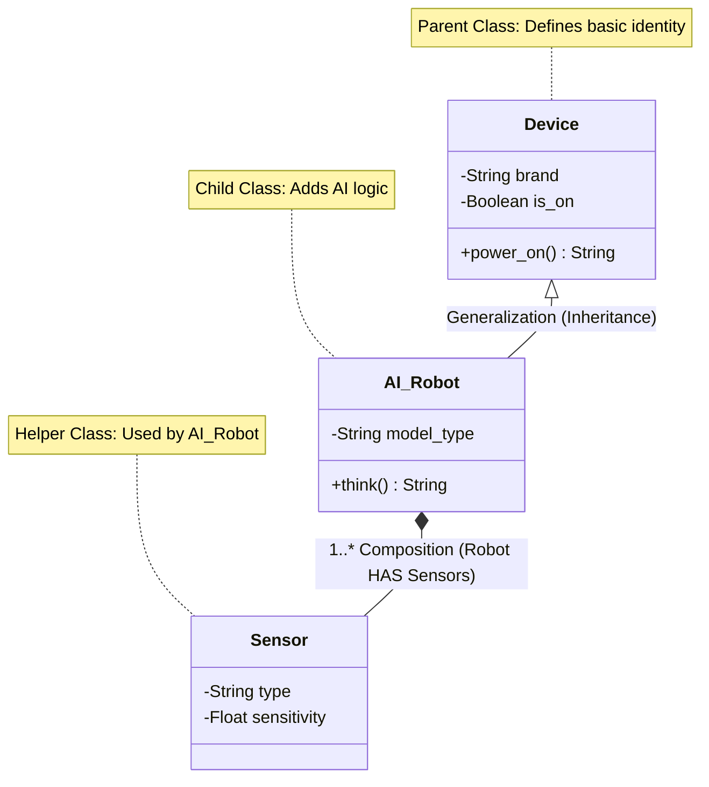
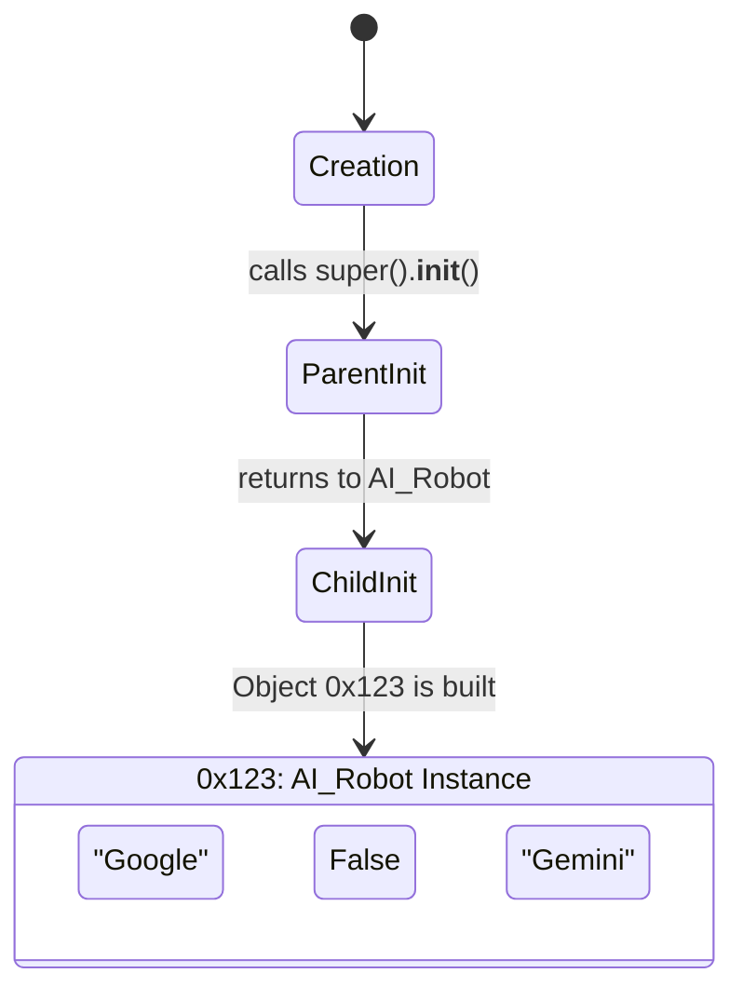

# Advanced UML Trace: Day 8 - Inheritance 🌲

This diagram follows the **Enterprise UML Standard** to show exactly how properties and methods are shared across the system.

## 1. Enterprise UML Class Diagram 📐

## 2. UML Symbol Key (How to Read Like a Pro) 🔍

| Symbol | Name | Meaning in AI |
| :--- | :--- | :--- |
| **`-`** | Private | This data is "hidden" inside the object (Encapsulation). |
| **`+`** | Public | This is an action anyone can call (API). |
| **` <|-- `** | Inheritance | The child "IS A" type of the parent. |
| **` *-- `** | Composition | The parent "OWNS" the child (It can't exist without it). |
| **` 1..* `** | Multiplicity | One Robot can have 1 or more Sensors. |

## 3. The Object Matrix (Memory State)
When you create `my_ai = AI_Robot("Google", "Gemini")`:

