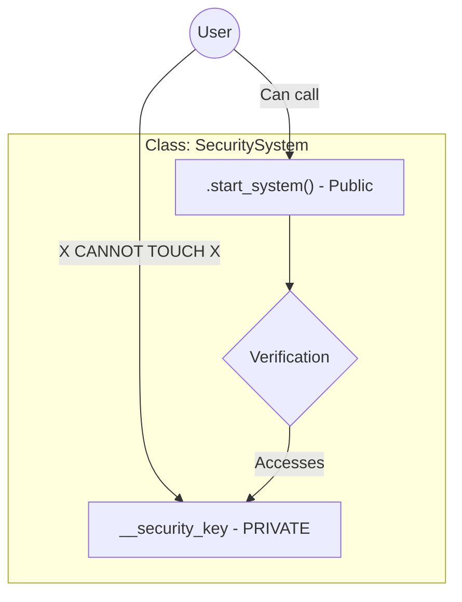

# Visual Trace: Day 9 - Secret Codes & Modern Art 🎨

## 1. Encapsulation: The "Private Room" 🔒
Think of a class like a high-security AI Lab. Not everyone should touch the `raw_data`.



## 2. Polymorphism: The "Master Interface" 🎭
In AI, we often swap models. Polymorphism allows us to call `predict()` on any model without knowing its type.

```mermaid
classDiagram
    class Model {
        <<interface>>
        +predict(data)
    }
    class CNN {
        +predict(data)
    }
    class Transformer {
        +predict(data)
    }

    Model <|-- CNN
    Model <|-- Transformer

    Note for Model "The 'Shape' is the same,\nthe 'Brain' inside is different."
```
